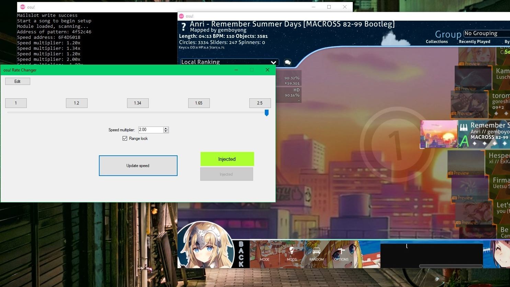
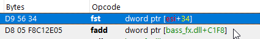
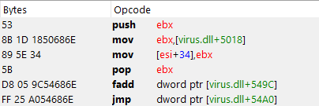

# osu! Rate changer



A song rate changer for osu! that doesn't rely on direct edits to the audio file.

## Features
  - External client to adjust in-game speed
  - Custom rates
  - Ability to set preset rates and save them
  - Atrocious UI design

## How to use
1. Make sure the game is started and **make sure you are signed out**
2. Click *inject*
3. Start any song (you can just start and immediately exit)
4. Now you can adjust the rate you want and click the *Update Speed* button
5. **Turn on any speed modifier mod (DT or HT)** (It will not work if you don't do this step)
6. You can start the song normally with the mod on

This also works in the edit menu if you want to change the speed there for some reason.

Setting the speed to 0 will likely crash the game.

## Limitations
  - You must play with the speed mods on
    - This is a problem for other game modes like mania (I can't play the other game modes well enough to tell) where speed is scaled up and back down. (eg. Selecting DT and playing at with lower speed multiplier than 1.5 will be as if you are playing with DT but physically slowed time down. The notes move slower and you have to increase your scroll speed)
    - Half time does the same thing but makes everything scroll faster
    - Can be counteracted by simply changing your scroll speed
  - The method used by the program uses DLL injection so your antivirus may flag it as a result.
  - You probably need to go offline since people can still spectate you but see the game as if it were at the regular mod speed. (You cannot submit scores online anyway since the audio desync will cause the game to nullify your score)

## Main advantages (Over editing audio files and maps)
  - AR scales properly (manually editing the map will limit you to a maximum of AR 10)
  - Removes the need to modify the map (first point. As well as not having to mess with OD settings to prevent excessive notelocking)
  - No gigantic song files from all the different rates

## Disclaimer
This program is not designed as a cheat should not be used as such. If you use it and get banned, that's your fault.

## Additional details
This program was written in a day and the preset editing feature was added the next day. It uses C# for the UI and C++ for whatever low level stuff goes on.

IPC works through mailslots where the address of the DLL's speed value (not bass_fx.dll) is posted by the injected DLL and read by another DLL that is controlled by C#. The speed is changed though the manipulation of the value at this address instead of in the game directly. (More on why I did this in the later part)
\
\
\
The original function that gets replaced:



Now jumps to this:




The internal function gets detoured by the injected DLL and the speed value (same as the one read externally) replaces the original in ```[esi + 34]```. This value changes when a different song is selected on the song selection screen so detouring the function would be more effective than modifying the value in this address every time you change songs.
